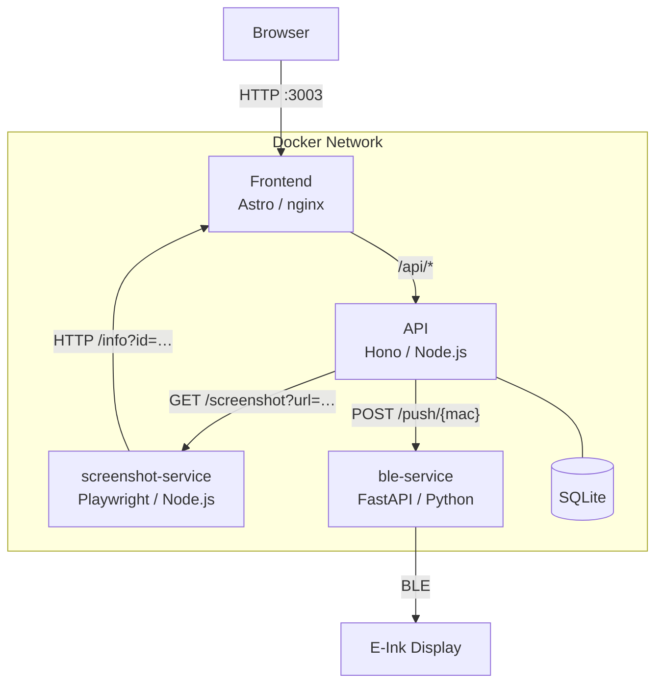

# EinkApp
EinkApp is a service that allows to render images from various sources on an e-ink painting/display.
It is built with a modular architecture, allowing to easily add new sources and renderers. It also provides an admin interface to manage the service and monitor its status.

## Features
- Modular architecture: easily add new sources and renderers
- Admin interface: manage the service and monitor its status

## Architecture

When a session's content is refreshed the following happens:
1. The **API** fetches new content from the configured generator (e.g. Reddit, Unsplash).
2. Connected browsers are updated via **SSE** (`/info-sse`).
3. The **API** asks the **screenshot-service** to render the `/info` page at the e-ink display resolution (250 × 122 px).
4. The resulting PNG is pushed over BLE to every linked display via the **ble-service**.
