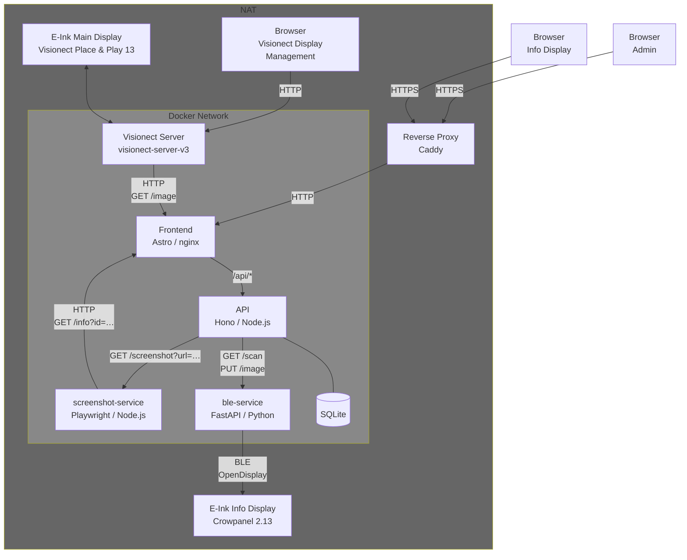
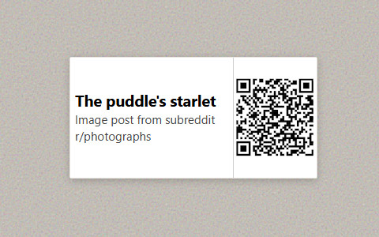
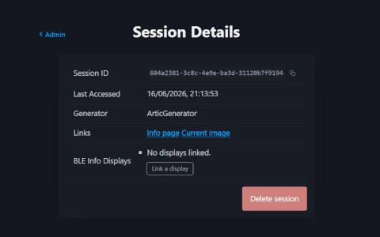

# EinkApp

This repository contains the code for an e-ink painting displayed in our living room. The painting is a [Visionect Place & Play](https://www.visionect.com/) that wirelessly cycles through art from various sources every half hour.

To make it feel like a real museum piece, I added an information card next to the painting just like you would find in a gallery. This card is a small secondary e-ink display (Crowpanel 2.13) that shows the title, description, and a QR code linking to the source of the currently displayed artwork. Communication with the Crowpanel uses the [OpenDisplay](https://opendisplay.org/) protocol. Since the OpenDisplay firmware did not support the Crowpanel out of the box, I added support for it. A contribution I hope to eventually get merged upstream.

Art is fetched from a variety of sources (Reddit, Unsplash, Art Institute of Chicago, Rijksmuseum, and more), each implemented as a separate module. The architecture is designed to make adding new sources as simple and straightforward as possible.

The system supports multiple displays by assigning a session to each one. Sessions can be managed through the admin interface, and a session ID can be used to retrieve information about the currently displayed content. There are two ways to access this information: visiting the info webpage in a browser (which updates automatically via Server-Sent Events when content changes), or pairing a secondary e-ink display like the Crowpanel, which receives updates over BLE whenever content changes. Since OpenDisplay communicates by sending images, a screenshot service is used to render the info webpage before transmitting it to the display.

## Architecture

## Screenshots

  <table>
    <tr>
      <td align="center" width="50%">
         
        <em>Living room - main display & info card</em>
      </td>
      <td align="center" width="50%">
         
        <em>Info page - title, description & QR code</em>
      </td>
    </tr>
    <tr >
      <td align="center">
         
        <em>Admin - session overview</em>
      </td>
    </tr>
  </table>

